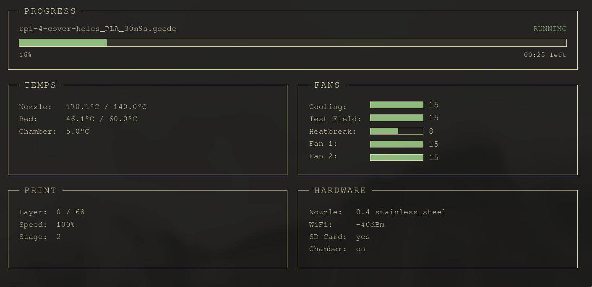

# Bonsai

An extremely minimal TUI-style web dashboard for monitoring a Bambu Lab A1 Mini 3D printer in real time. Connects to the printer over MQTT (SSL/TLS), parses status messages, and streams live updates to the browser.



## Environment Variables

| Variable    | Description           |
| ----------- | --------------------- |
| `IP`        | Printer IP address    |
| `SERIAL`    | Printer serial number |
| `MQTT_USER` | MQTT username         |
| `PASS`      | MQTT password         |

Copy `.env.example` to `.env` and fill in your printer's values.

## Running

```sh
go run .
```

The server starts at `http://localhost:3100`. The MQTT client connects to `ssl://<IP>:8883` and subscribes to `device/<serial>/report`.

## Docker

Build and run with Docker:

```sh
docker build -t bonsai .
docker run -p 3100:3100 \
  -e IP=192.168.1.100 \
  -e SERIAL=abc123 \
  -e MQTT_USER=myuser \
  -e PASS=mypassword \
  bonsai
```

Or with Docker Compose — edit the environment values in `docker-compose.yml` then:

```sh
docker compose up -d
```
